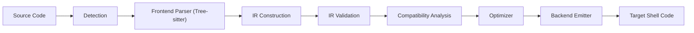

# Architecture

ShellX is structured as a compiler-style translation pipeline.

## Pipeline

## Major Modules

- `detection/`
  - Detects probable input dialect from extension/shebang/content.
- `frontend/`
  - Parses source into syntax trees and converts AST to IR.
- `ir/`
  - Core intermediate representation (statements, expressions, locations).
- `optimizer/`
  - Optimization passes (constant folding, CSE, dead code elimination, pipeline simplification).
- `compat/`
  - Capability comparison, warnings, shim recommendation support.
- `backend/`
  - Emits target shell code from IR.
- `shellx.odin`
  - Public API facade and orchestration.

## IR Design

IR is expression/statement-based (not raw strings), enabling:

- Analysis (validation, compatibility checks)
- Transformations (optimizations)
- Cleaner backend emission

Each relevant node carries `SourceLocation` metadata for diagnostics.

## Frontend/Backend Design

Frontends are dialect-specific converters into a shared IR.
Backends are dialect-specific emitters from shared IR.

This separation allows adding dialect support incrementally without changing API shape.

## Design Decisions

- Manual memory management with arenas for IR-heavy operations.
- Public API returns explicit result objects with explicit cleanup.
- Strict mode uses compatibility error severity to block risky translations.
- Translation options are centralized in `TranslationOptions`.
